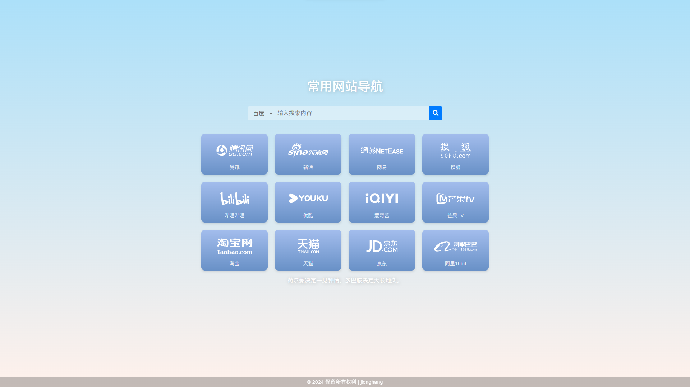

# Simple-Navigation-Page

HTML implemented browser navigation page. 

HTML实现的浏览器导航页。

The implementation of this navigation page is relatively simple, and you can directly modify the `index.html` file in the project for personalized development.

改导航页的实现比较简单，可直接修改项目中`index.html`文件进行个性化开发。
